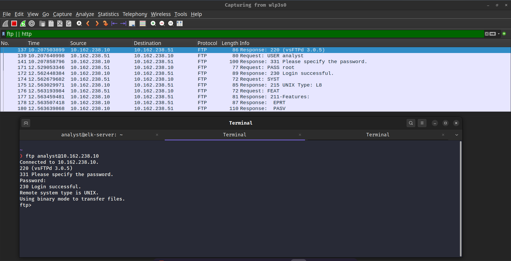
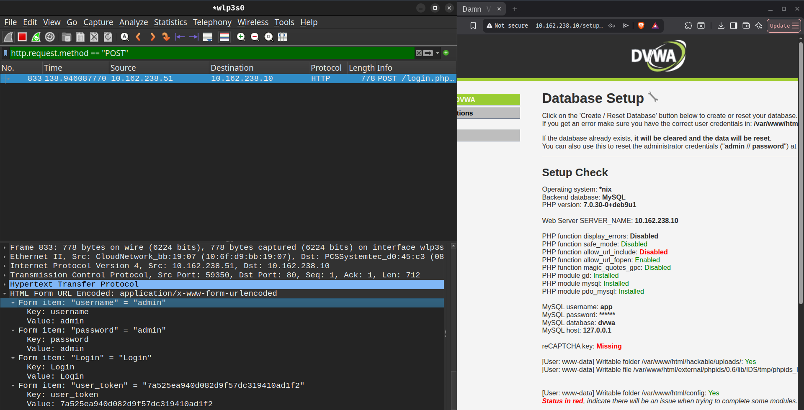
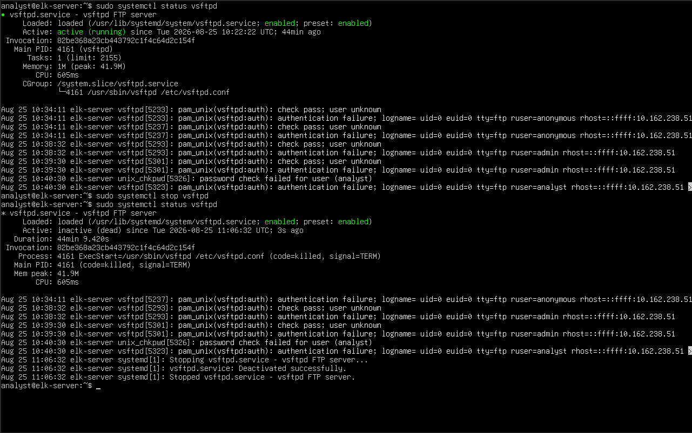
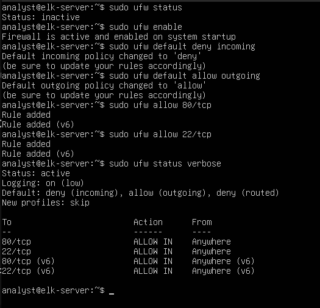
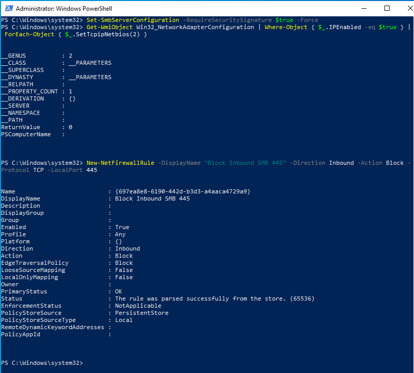
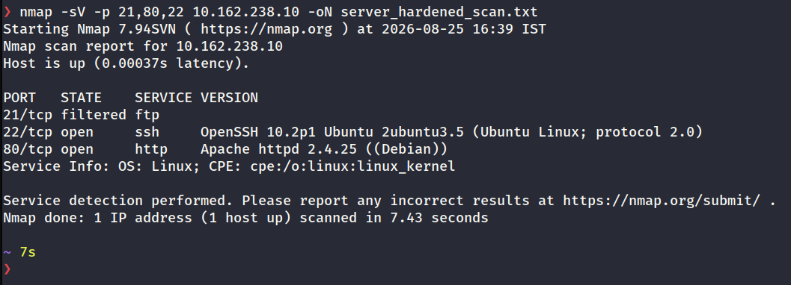

<div align="center">

# Mini Enterprise Network Infrastructure

## Capstone Project Report – Network Security & VAPT Assessment

### Online Cybersecurity Internship Project

<br>

**Prepared By**

**Naveen William**

<br>

**Role**

Network Security Specialist / VAPT Trainee

<br>

**Assessment Type**

Vulnerability Assessment, Traffic Analysis & System Hardening

<br>

**Assessment Environment**

Virtual Laboratory Subnet (`10.162.238.0/24`)

<br>

**Submission Date**

August 2026

</div>

<div style="page-break-after: always;"></div>

# Document Control

| Field | Details |
| -------- | --------- |
| **Document Title** | Design, Implementation, and Security Assessment of a Mini Enterprise Network |
| **Project Type** | Capstone Project – Online Internship |
| **Prepared By** | Naveen William |
| **Role** | Network Security Specialist / VAPT Trainee |
| **Target Infrastructure** | Heterogeneous Enterprise Network (Windows 10 & Ubuntu Server) |
| **Core Technology** | Nmap, Wireshark, UFW, PowerShell, Docker, DVWA, Linux Subsystem |
| **Version** | 1.1 |
| **Classification** | Educational / Academic VAPT Project Report |
| **Submission Date** | 25th August 2026 |

---

## Revision History

| Version | Date | Description | Author |
| ---------- | ------ | ------------- | -------- |
| 1.0 | August 2026 | Initial Network VAPT & Hardening Report | Naveen William |
| 1.1 | August 2026 | Added Windows 10 Host Hardening & Screenshot Mapping | Naveen William |

<div style="page-break-after: always;"></div>

## 2. Executive Summary

Enterprise subnets require balanced network architecture, service isolation, and continuous vulnerability assessment to mitigate exposure to malicious actors. This technical report details the end-to-end design, virtual deployment, security assessment, traffic analysis, and cross-platform system hardening of a mini enterprise network environment.

The infrastructure consists of a three-host virtual enterprise topology model within the `10.162.238.0/24` subnet: an Attack/Investigator Host (`10.162.238.51`), an Employee Workstation running Windows 10 (`10.162.238.20`), and an Enterprise Web/Database Server hosting containerized web applications (DVWA) alongside legacy network daemons (`vsftpd`). Port scanning and active enumeration using Nmap identified exposed legacy services, including unencrypted FTP on TCP port 21, as well as SMB and RPC exposure on the workstation. Traffic analysis conducted via Wireshark captured cleartext credentials transmitted over unencrypted protocol streams.

Following the initial discovery phase, cross-platform hardening measures were executed: service deprecation and stateful Uncomplicated Firewall (UFW) policy enforcement on the server endpoint, alongside ICMP dropping, SMB firewall rules, and mandatory SMB security signing on the Windows endpoint. Post-remediation verification scans confirmed that unencrypted entry vectors were blocked (`filtered`) and host visibility was restricted while preserving core operational services.

## 3. Scope & Objectives

* **Network Architecture & IP Planning:** Design and document a structured IP addressing scheme connecting isolated virtual endpoints within a single broadcast domain.
* **Virtual Deployment & Interconnectivity:** Configure and validate bidirectional ICMP reachability across Windows and Linux operating systems.
* **Reconnaissance & Service Enumeration:** Execute network sweeps and deep service scans using Nmap to map open ports, operational daemons, hostnames, and OS details.
* **Network Traffic Analysis:** Capture active protocol streams with Wireshark to demonstrate the security risks of cleartext authentication protocols.
* **Cross-Platform System Hardening:** Remediate identified exposure vectors by terminating legacy daemons on Linux (UFW) and hardening SMB/ICMP policies on Windows 10.
* **Validation Scanning:** Perform post-remediation Nmap scans to verify the effectiveness of the implemented remediation controls.

<div style="page-break-after: always;"></div>

## 4. System Architecture & IP Addressing

The environment simulates a small enterprise network layout consisting of an administration/audit machine, a client workstation endpoint, and a multi-service web and database server.

```text
                  ┌──────────────────────────────┐
                  │    Ubuntu Attack Machine     │
                  │        (Investigator)        │
                  │        10.162.238.51         │
                  └──────────────┬───────────────┘
                                 │
                ┌────────────────┴────────────────┐
                │ Internal Subnet 10.162.238.0/24 │
                └────────┬───────────────┬────────┘
                         │               │
                         ▼               ▼
           ┌───────────────────┐   ┌───────────────────┐
           │   Windows 10 VM   │   │  Ubuntu Server VM │
           │   (Workstation)   │   │    (WebServer)    │
           │   10.162.238.20   │   │   10.162.238.10   │
           └───────────────────┘   └───────────────────┘
```

| **Device Name**       | **Operating System** | **Subnet IP Address** | **MAC Address**       | **Role / Exposed Services**                                      |
|-----------------------|----------------------|------------------------|------------------------|-------------------------------------------------------------------|
| **Attacker Host**     | Ubuntu Linux         | `10.162.238.51`        | `10:6f:d9:bb:19:07`    | Reconnaissance, Traffic Analysis, Audit                          |
| **Workstation**       | Windows 10 Pro       | `10.162.238.20`        | `08:00:27:ad:fd:ba`    | Employee Endpoint (MSRPC, NetBIOS, SMB)                         |
| **Enterprise Server** | Ubuntu Server        | `10.162.238.10`         | *Target Interface*     | Web App (DVWA: 80), FTP (`vsftpd`: 21)                          |

<div style="page-break-after: always;"></div>

## 5. Reconnaissance & Service Enumeration

Active network enumeration was conducted from the primary attack host (10.162.238.51) against all target endpoints inside the 10.162.238.0/24 subnet.

### 5.1 Subnet Host Discovery

```bash
nmap -sn 10.162.238.0/24
```

Result: Confirmed active host ICMP response across 10.162.238.20 (Windows 10) and the Ubuntu Server host prior to firewall hardening.

### 5.2 Workstation Enumeration (10.162.238.20)

A target port scan was executed against standard administrative and file-sharing ports:

```bash
nmap -sV -sC -p 135,139,445,3389 -oN win10_init_scan.txt 10.162.238.20
```

**Target Output Log** (`win10_init_scan.txt`):

```text
Nmap scan report for 10.162.238.20
Host is up (0.00044s latency).

PORT     STATE  SERVICE       VERSION
135/tcp  open   msrpc         Microsoft Windows RPC
139/tcp  open   netbios-ssn   Microsoft Windows netbios-ssn
445/tcp  open   microsoft-ds?
3389/tcp closed ms-wbt-server
Service Info: OS: Windows; CPE: cpe:/o:microsoft:windows

Host script results:
|_nbstat: NetBIOS name: DESKTOP-HQS02MS, NetBIOS user: <unknown>, NetBIOS MAC: 08:00:27:ad:fd:ba (Oracle VirtualBox virtual NIC)
| smb2-time: 
|   date: 2026-08-25T10:36:01
|_  start_date: N/A
| smb2-security-mode: 
|   3:1:1: 
|_    Message signing enabled but not required
```

* Findings: Windows RPC (135), NetBIOS (139), and SMB (445) are active. Remote Desktop (3389) is currently disabled (closed). SMB message signing was enabled but not required, meaning SMB sessions were not configured to require signing. This configuration can increase exposure to certain relay and man-in-the-middle attack scenarios.

<div style="page-break-after: always;"></div>

## 5.3 Server Endpoint Enumeration (Initial Scan)

Deep enumeration was executed against the Ubuntu Server VM to identify active application services:

```bash
nmap -sV -sC -O -p- 10.162.238.10 -oN server_init_scan.txt
```

**Target Output Log** (`server_init_scan.txt`):

```text
# Nmap 7.94SVN scan initiated Tue Aug 25 16:03:52 2026 as: nmap -sV -sC -O -p- -oN server_init_scan.txt 10.162.238.10
Nmap scan report for 10.162.238.10
Host is up (0.00038s latency).
Not shown: 65532 closed tcp ports (reset)
PORT   STATE SERVICE VERSION
21/tcp open  ftp     vsftpd 3.0.5
22/tcp open  ssh     OpenSSH 10.2p1 Ubuntu 2ubuntu3.5 (Ubuntu Linux; protocol 2.0)
80/tcp open  http    Apache httpd 2.4.25 ((Debian))
|_http-server-header: Apache/2.4.25 (Debian)
| http-title: Login :: Damn Vulnerable Web Application (DVWA) v1.10 *Develop...
|_Requested resource was login.php
| http-robots.txt: 1 disallowed entry 
|_/
| http-cookie-flags: 
|   /: 
|     PHPSESSID: 
|_      httponly flag not set
MAC Address: 08:00:27:D0:45:C3 (Oracle VirtualBox virtual NIC)
No exact OS matches for host (If you know what OS is running on it, see https://nmap.org/submit/ ).
TCP/IP fingerprint:
OS:SCAN(V=7.94SVN%E=4%D=8/25%OT=21%CT=1%CU=30436%PV=Y%DS=1%DC=D%G=Y%M=08002
OS:7%TM=6A8D6FA7%P=x86_64-pc-linux-gnu)SEQ(SP=FA%GCD=1%ISR=10C%TI=Z%CI=Z%TS
OS:=20)SEQ(SP=FA%GCD=1%ISR=10C%TI=Z%CI=Z%II=I%TS=20)OPS(O1=M5B4ST11NW9%O2=M
OS:5B4ST11NW9%O3=M5B4NNT11NW9%O4=M5B4ST11NW9%O5=M5B4ST11NW9%O6=M5B4ST11)WIN
OS:(W1=FE88%W2=FE88%W3=FE88%W4=FE88%W5=FE88%W6=FE88)ECN(R=Y%DF=Y%T=40%W=FAF
OS:0%O=M5B4NNSNW9%CC=Y%Q=)T1(R=Y%DF=Y%T=40%S=O%A=S+%F=AS%RD=0%Q=)T2(R=N)T3(
OS:R=N)T4(R=Y%DF=Y%T=40%W=0%S=A%A=Z%F=R%O=%RD=0%Q=)T5(R=Y%DF=Y%T=40%W=0%S=Z
OS:%A=S+%F=AR%O=%RD=0%Q=)T6(R=Y%DF=Y%T=40%W=0%S=A%A=Z%F=R%O=%RD=0%Q=)T7(R=Y
OS:%DF=Y%T=40%W=0%S=Z%A=S+%F=AR%O=%RD=0%Q=)U1(R=Y%DF=N%T=40%IPL=164%UN=0%RI
OS:PL=G%RID=G%RIPCK=G%RUCK=G%RUD=G)IE(R=Y%DFI=N%T=40%CD=S)

Network Distance: 1 hop
Service Info: OSs: Unix, Linux; CPE: cpe:/o:linux:linux_kernel

OS and Service detection performed. Please report any incorrect results at https://nmap.org/submit/ .
# Nmap done at Tue Aug 25 16:04:15 2026 -- 1 IP address (1 host up) scanned in 23.10 seconds
```

* Findings:

  * TCP Port 21 (FTP): Running vsftpd service allowing cleartext network access.

  * TCP Port 80 (HTTP): Exposing Docker-hosted Damn Vulnerable Web Application (DVWA) server environment.


<div style="page-break-after: always;"></div>

## 6. Traffic Analysis & Vulnerability Proof

To evaluate protocol security across the subnet, traffic captures were recorded into network_log.pcapng using Wireshark on interface wlp3s0.
```text
Attacker Host ──► Network Protocol Traffic ──► Server / Workstation Endpoints
      │
      └─► Wireshark Capture (network_log.pcapng): Plaintext USER & PASS extracted
```

### 6.1 Cleartext FTP Credential Interception

During an active FTP session initiated toward the server endpoint, authentication packets were sniffed and reconstructed using Wireshark's Follow TCP Stream feature.

* **Protocol:** File Transfer Protocol (FTP)

* **Observed Packets:** Unencrypted payload headers

* **Captured Credentials:** USER analyst / PASS root

| **Attribute**           | **Vulnerability Assessment Details**                                                                                                    |
|-------------------------|-----------------------------------------------------------------------------------------------------------------------------------------|
| **Finding**             | Unencrypted File Transfer Protocol (FTP) Authentication Stream                                                                          |
| **Protocol / Port**     | FTP / TCP Port 21                                                                                                                       |
| **Authentication Type** | Cleartext Payload Transmission                                                                                                          |
| **Captured Evidence**   | `images/plaintext_ftp_cred.png` (`USER analyst` / `PASS root`)                                                                    |
| **Impact**              | Credentials can be observed, intercepted, and reused by any local network attacker executing passive sniffing or ARP poisoning attacks. |
| **Remediation**         | Deprecate FTP daemon (`vsftpd`); enforce secure encrypted transfers using SFTP / SSH (TCP Port 22).                                     |




<div style="page-break-after: always;"></div>

### 6.2 Cleartext HTTP Web Application Capture

HTTP POST requests sent to the DVWA web application were captured on TCP port 80, revealing raw parameter fields passed across the wire.

* **Risk Assessment:** Transmitting credentials over cleartext channels exposes enterprise accounts to eavesdropping, ARP spoofing, and session hijacking vectors across local segments.
  
| **Attribute**           | **Vulnerability Assessment Details**                                                                                                             |
|-------------------------|--------------------------------------------------------------------------------------------------------------------------------------------------|
| **Finding**             | Unencrypted HTTP POST Request Transmitting Web Authentication Data                                                                               |
| **Protocol / Port**     | HTTP / TCP Port 80                                                                                                                               |
| **Authentication Type** | Cleartext HTTP Form Data                                                                                                                         |
| **Captured Evidence**   | `images/plaintext_dvwa_cred.png` (`username=admin`, `password=password`)                                                                         |
| **Impact**              | Session tokens, administrative credentials, and sensitive POST data are completely exposed to local network eavesdropping and session hijacking. |
| **Remediation**         | Enforce Transport Layer Security (TLS 1.3) with HTTPS (TCP Port 443) and redirect all cleartext HTTP requests.                                  |



<div style="page-break-after: always;"></div>

## 7. System Hardening & Mitigation

Defensive hardening measures were executed across both Linux server and Windows client endpoints to shrink the total attack surface.

### 7.1 Server Endpoint Hardening (Ubuntu Linux)

* **Legacy Service Termination:** The unencrypted FTP daemon was stopped and permanently disabled from system startup:

  ```bash
  sudo systemctl stop vsftpd
  ```
  

* **UFW Firewall Configuration:** A strict default-deny firewall posture was established using Uncomplicated Firewall (UFW):

  ```bash
  sudo ufw default deny incoming
  sudo ufw default allow outgoing
  sudo ufw allow 80/tcp    # HTTP - Web Access
  sudo ufw allow 22/tcp    # SSH - Encrypted Admin
  sudo ufw enable
  ```
  

### 7.2 Workstation Endpoint Hardening (Windows 10)
Defensive configurations were executed via PowerShell as Administrator:

* **Inbound ICMP Echo Request Restriction (Ping Blocking):** Enabling Windows Defender Firewall blocks inbound ICMPv4 Echo Requests by default, rendering the workstation silent to standard ICMP ping sweeps (`nmap -sn`).

* **SMB Security Signing Enforcement:** Enforced SMB message signing to mitigate NTLM relay and Man-in-the-Middle (MitM) attacks:

  ```PowerShell
  Set-SmbServerConfiguration -RequireSecuritySignature $true -Force
  ```

* **Firewall Inbound Restrictions:** Enforced inbound rules blocking unauthenticated SMB traffic over port 445:

  ```PowerShell
  New-NetFirewallRule -DisplayName "Block Inbound SMB 445" -Direction Inbound -Action Block -Protocol TCP -LocalPort 445
  ```
  


<div style="page-break-after: always;"></div>

## 8. Post-Hardening Validation Scan
Post-remediation scans were executed from `10.162.238.51` to validate the efficiency of the applied controls across both hosts.

### 8.1 Verification Commands
```
# Ubuntu Server Post-Hardening Check
nmap -sV -p 21,80,22 10.162.238.10 -oN server_hardened_scan.txt
```



```
# Windows 10 Workstation Post-Hardening Check (Using -Pn due to ICMP block)
nmap -Pn -sV -p 135,139,445,3389 10.162.238.20 -oN win10_hardened_scan.txt
```


### 8.2 Validation Proof

### Comparative Findings Matrix

| **Target Host**   | **Service / Component** | **Initial State**        | **Post-Hardening State**   | **Remediation Action Taken**                         |
|-------------------|-------------------------|--------------------------|----------------------------|------------------------------------------------------|
| **Ubuntu Server** | TCP 21 (FTP)            | `OPEN`                   | `FILTERED`      | Service stopped via `systemctl stop vsftpd`; UFW drops incoming probes on port 21               |
| **Ubuntu Server** | TCP 80 (HTTP)            | `OPEN`                   | `OPEN`                     | Retained for legitimate DVWA application traffic    |
| **Windows 10**    | ICMP Echo (Ping)        | `RESPONSIVE`             | `DROPPED` / `UNRESPONSIVE` | Windows Defender Firewall drops incoming ICMP sweeps |
| **Windows 10**    | TCP 445 (SMB)           | `OPEN`                   | `FILTERED`                 | Inbound port 445 blocked via Windows Firewall       |
| **Windows 10**    | SMB Signing             | `Enabled (Not Required)` | `Required`                 |   Mandatory packet signing enforced via PowerShell                                                   |

*Verification confirmed that unencrypted entry vectors were neutralized, ICMP recon sweeps were negated, and vital business applications remained accessible.*

## 9. Hardening Recommendations
* **Enforce Transport Layer Encryption:** Transition all cleartext HTTP web application endpoints to HTTPS (TLS 1.3) using valid SSL/TLS certificates.
  *The DVWA instance was intentionally deployed as a vulnerable application for security assessment. Its HTTP transport should not be considered suitable for production deployment. In a production environment, authenticated web applications should use HTTPS with appropriately configured TLS.*

* **Deprecate Legacy Protocols:** Permanently purge FTP, Telnet, and unencrypted HTTP from enterprise host templates, enforcing SSH/SFTP exclusively.

* **Network Segmentation:** Place workstation endpoints, servers, and administrative hosts into dedicated Virtual LANs (VLANs) governed by firewall access control lists (ACLs).

* **Centralized Policy Management:** Deploy Active Directory Group Policy Objects (GPO) to enforce SMB signing, firewall profiles, and audit policies domain-wide.

<div style="page-break-after: always;"></div>

## 10. Conclusion
This project successfully completed the design, implementation, evaluation, and security hardening of a mini enterprise network. Initial enumeration and packet analysis highlighted critical exposure points associated with cleartext FTP services and unconstrained Windows network protocols, allowing plain text credentials to be harvested over the wire. By implementing UFW stateful firewall policies on Linux, enforcing ICMP stealth and SMB signing on Windows 10, and disabling unneeded daemons, the environment's total attack surface was systematically reduced as verified by post-remediation Nmap scans. This hands-on exercise reinforces fundamental VAPT techniques, packet analysis workflows, and practical defense-in-depth methodologies essential for modern enterprise network security.

## 11. References
Nmap Project. *Nmap Network Mapper Reference Guide.* https://nmap.org/book/man.html

Wireshark Foundation. *Wireshark User's Guide: Packet Inspection & Display Filters.* https://www.wireshark.org/docs/wsug_html_chunked/

Microsoft Learn. *Overview of Server Message Block (SMB) Signing.* https://learn.microsoft.com/en-us/windows-server/storage/file-server/smb-signing

Ubuntu Documentation. *Uncomplicated Firewall (UFW) Setup Guide.* https://ubuntu.com/server/docs/how-to/security/firewalls/

MITRE ATT&CK Framework. *Network Service Discovery (T1046) & Network Sniffing (T1040).* https://attack.mitre.org/techniques/T1040/